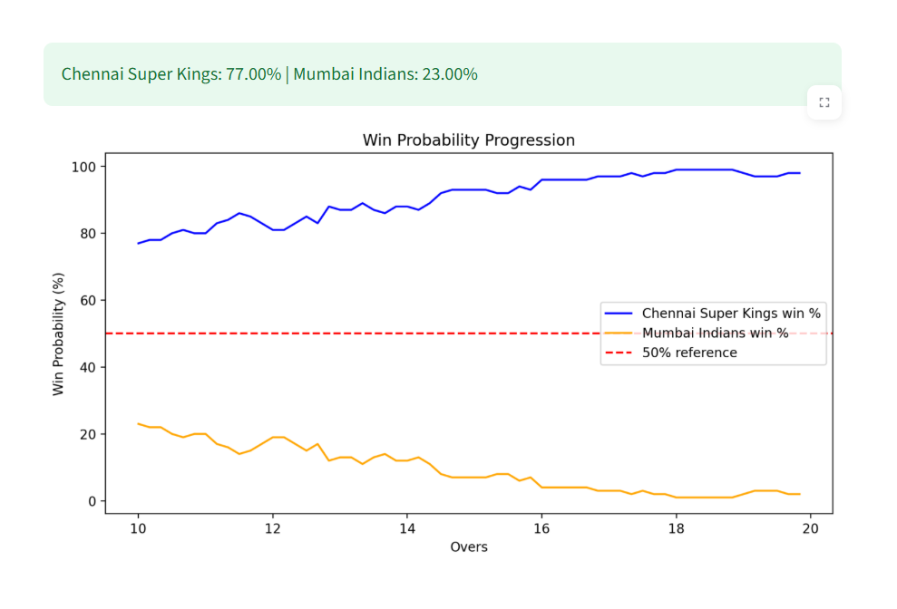
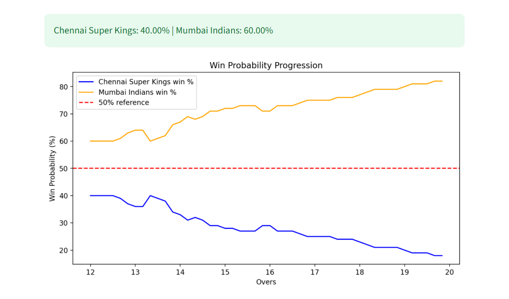

# 🏏 IPL Win Predictor

A machine learning-powered **IPL match win predictor** built with **Streamlit**.  
Given the current match situation (target, score, overs, wickets), the app predicts the **probability of the batting team winning** and visualizes how this probability changes over the remaining overs.

# Live Demo : https://ipl-win-predictor-app.streamlit.app/

---

## 🚀 Features
- Interactive **Streamlit web app**
- Choose **batting team, bowling team, and venue**
- Enter match details: target, score, overs, wickets
- Predict **win probability (%)**
- Visualize **probability progression** until 20 overs
- Built using:
  - `scikit-learn` (Random Forest + pipeline)
  - `pandas`, `numpy`
  - `matplotlib` / `plotly` for visualization
  - `streamlit` for deployment

---

## 📊 Example

### Scenario 1 – Batting team ahead  
- **Target:** 180  
- **Score:** 95/1 after 10 overs  

---

### Scenario 2 – Bowling team ahead  
- **Target:** 170  
- **Score:** 70/5 after 12 overs  

